# Why I Use Git Submodules for Development Context and Extensions

> **📋 Viewing Note**: This document contains Mermaid diagrams. To view them properly:
> - **VS Code**: Install the "Markdown Preview Mermaid Support" extension
> - **GitHub/GitLab**: Diagrams render automatically in the web interface
> - **Other IDEs**: Look for Mermaid or diagram preview extensions
> - **Local viewing**: Use a Mermaid-compatible markdown viewer

## Architecture Overview

```mermaid
graph TB
    subgraph "Main Repository: copilot-working-context"
        A[📋 README.md<br/>Working Preferences]
        B[⚙️ .gitattributes<br/>Line Endings Config]
        C[📝 .editorconfig<br/>Editor Settings]
        D[🔧 .vscode/settings.json<br/>VS Code Config]
        E[📚 docs/<br/>Architecture Documentation]
        F[🔗 .gitmodules<br/>Submodule References]
    end

    subgraph "Submodule: vs-code-extensions"
        G[💻 src/<br/>Extension Source Code]
        H[📦 package.json<br/>Dependencies & Scripts]
        I[🏗️ esbuild.js<br/>Build Configuration]
        J[🧪 test/<br/>Test Suites]
        K[📁 node_modules/<br/>Dependencies]
        L[🔨 dist/<br/>Build Artifacts]
    end

    subgraph "Submodule: jira-tools"
        M[⚙️ JiraTools.csproj<br/>C# Project Configuration]
        N[💼 src/<br/>CLI Application Code]
        O[📋 .env<br/>Jira Credentials & Config]
        P[🧪 tests/<br/>Unit Tests]
        Q[📖 USAGE_GUIDE.md<br/>Command Documentation]
        R[🚀 bin/<br/>Compiled CLI Tool]
    end

    subgraph "Development Workflows"
        S[👥 Context Contributors<br/>Update preferences & docs]
        T[🔧 Extension Developers<br/>Build & test extensions]
        U[⚡ Workflow Automation<br/>Use CLI for Jira management]
    end

    subgraph "Benefits"
        V[🚀 Fast Cloning<br/>Lightweight main repo]
        W[🔄 Independent Updates<br/>Separate release cycles]
        X[♻️ Reusable Tools<br/>Share across projects]
        Y[🧹 Clean History<br/>Focused commit logs]
    end

    F -.->|references specific commit| G
    F -.->|references specific commit| M
    S -->|works on| A
    S -->|works on| E
    T -->|works on| G
    T -->|works on| H
    U -->|uses| N
    U -->|configures| O

    A --> V
    F --> W
    G --> X
    M --> X
    S --> Y

    style A fill:#e1f5fe
    style E fill:#e1f5fe
    style G fill:#fff3e0
    style H fill:#fff3e0
    style M fill:#e8f5e8
    style N fill:#e8f5e8
    style O fill:#f3e5f5
    style P fill:#f3e5f5
    style Q fill:#f3e5f5
    style R fill:#f3e5f5
```



## The Problem: Mixing Concerns

When developing VS Code extensions alongside context documentation, several issues arise:

### **Repository Pollution**
- Extension build artifacts cluttering the main repository
- node_modules directories making the repo heavy
- Test files and compilation outputs mixed with documentation
- Version history becomes polluted with implementation details

### **Conflicting Update Cycles**
- Context preferences evolve slowly and should remain stable
- Extension implementations need rapid iteration and experimentation
- Documentation updates shouldn't trigger extension rebuilds
- Extension testing shouldn't interfere with context repository cleanliness

### **Collaboration Complexity**
- Contributors to context preferences don't need extension development setup
- Extension developers don't need to understand the entire context repository
- Mixed responsibilities make it unclear where to contribute different types of changes

## The Solution: Submodule Architecture

### **Clean Separation of Concerns**

**Main Repository (copilot-working-context):**
- Contains only stable, long-lived documentation
- Focuses on preferences, patterns, and architectural decisions
- Minimal dependencies, fast to clone and understand
- Clean commit history focused on preference evolution

**Submodule Repository (vs-code-extensions):**
- Contains VS Code extension implementation code, build systems, and dependencies
- Focused entirely on extension functionality and testing
- Can be developed, tested, and deployed independently
- Has its own release cycle and versioning

**Submodule Repository (jira-tools):**
- Contains CLI workflow automation tools for Jira integration
- Focused on development workflow assistance and story management
- Can be updated and deployed independently
- Provides consistent workflow automation across different projects

### **Independent Development Workflows**

**Context Updates:**
```
1. Update preferences in main repository
2. Commit documentation changes
3. Push immediately without waiting for implementation
4. Changes are immediately available to all context consumers
```

**Extension Development:**
```
1. Work entirely within the submodule directory
2. Test, build, and iterate without affecting main repository
3. Commit implementation changes to extension repository
4. Update submodule reference only when ready for integration
```

### **Reusability and Modularity**

**Extension Sharing:**
- Extensions can be used across multiple context repositories
- Different projects can reference the same extension at different versions
- Extension improvements benefit all dependent projects
- No code duplication across different context setups

**Context Portability:**
- Main repository stays lightweight and portable
- Can be cloned quickly for reference without heavy dependencies
- Context documentation remains accessible even without extension development setup
- Easy to fork for different teams or projects

## Real-World Benefits

### **Development Experience**
- **Faster iteration**: Extension development doesn't require full repository context
- **Cleaner diffs**: Implementation changes don't pollute documentation history
- **Focused work**: Each repository has a single, clear responsibility
- **Easier onboarding**: New contributors can focus on relevant repository

### **Operational Advantages**
- **Selective updates**: Update context without rebuilding extensions
- **Version pinning**: Lock extensions to specific versions for stability
- **Parallel development**: Multiple developers can work on different aspects simultaneously
- **Clean releases**: Context updates and extension releases happen independently

### **Cross-Platform Consistency**
- **Uniform setup**: Same submodule structure works on Windows, macOS, and Linux
- **Consistent dependencies**: Extension dependencies isolated from main repository
- **Platform-specific builds**: Extensions can have platform-specific build processes without affecting context

## Alternative Approaches Considered

### **Monorepo with Folders**
❌ **Rejected because:**
- Still mixes concerns in single repository
- Build artifacts pollute the main repository
- All contributors need full development setup
- Version history becomes cluttered with implementation details

### **Separate Repositories with Manual Coordination**
❌ **Rejected because:**
- No formal relationship between context and extensions
- Manual coordination required for compatibility
- Difficult to ensure version consistency
- No clear dependency management

### **Package Management (npm, etc.)**
❌ **Rejected because:**
- Adds packaging complexity for development tools
- Requires publication workflow for private extensions
- Less flexible for rapid development and testing
- Doesn't solve the repository pollution problem

## Implementation Guidelines

### **When to Update Submodule Reference**
- After successful extension testing
- When extension reaches stable milestone
- Before major context repository releases
- When extension compatibility is verified

### **Development Workflow**
1. **Daily work**: Develop extensions in submodule without updating reference
2. **Testing**: Test extension compatibility with current context
3. **Integration**: Update submodule reference only when ready
4. **Documentation**: Update context preferences based on extension experience

### **Collaboration Model**
- **Context maintainers**: Focus on preferences and architectural decisions
- **Extension developers**: Focus on implementation and functionality
- **Cross-functional**: Both groups collaborate on integration points

## Conclusion

Git submodules provide the architectural clarity and operational flexibility needed for sustainable development of context-driven tooling. They enable clean separation of concerns while maintaining formal relationships between components, supporting both rapid iteration and long-term maintainability.

This approach aligns with clean architecture principles by establishing clear boundaries, supporting independent deployment, and enabling focused development workflows.
